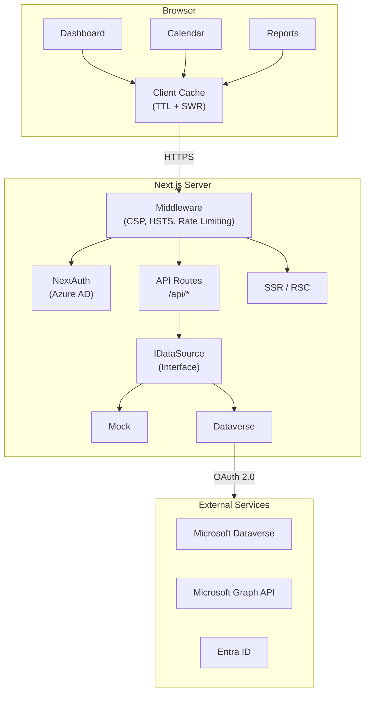

# Developico Timesheet

[](LICENSE)
[](https://nodejs.org/)
[](https://www.typescriptlang.org/)
[](https://nextjs.org/)
[](https://pnpm.io/)

> 🇵🇱 [Wersja polska](README.md)

Time tracking and project management dashboard for consultants. Built with Next.js 14, TypeScript, Tailwind CSS and shadcn/ui. Integration with Microsoft Dataverse and Microsoft Graph API.

## 🎯 Features

### Time Registration
- Weekly calendar view (8:00–18:00)
- Time entry registration: project, task, hours, description, billable flag
- Days off / holiday marking
- Weekly summary (billable / non-billable)

### KPI Dashboard
- Cards: total hours, active projects, consultants, pending approvals
- Weekly hours chart (7-day trend)
- Monthly revenue chart (6-month trend)
- Active projects table with budget and assignments

### Project Management
- Project listing with filters: status, assignment, billable, search
- Sorting by any column
- Project creation form (name, code, client, status, budget, dates)
- Project detail panel

### Reports
- Dynamic report builder
- Filters: date range, group by (project/consultant/client), billable status
- Multi-select consultants and projects
- Data export

### Administration
- Consultant impersonation (ConsultantDock)
- Viewing banner (who is viewing whose data)
- RBAC: Consultant | Administrator

## 🏗️ Architecture



## 🚀 Quick Start

### Prerequisites

- Node.js 20+ (see `.nvmrc`)
- pnpm 10+

### Installation

```bash
corepack enable
corepack prepare pnpm@latest --activate
pnpm install
cp .env.example .env.local
pnpm dev
```

App: http://localhost:3000 (mock data mode by default).

### Production Build

```bash
pnpm typecheck
pnpm lint
pnpm test
pnpm build
pnpm start
```

## 📋 Scripts

| Command | Description |
|---------|-------------|
| `pnpm dev` | Development server (port 3000) |
| `pnpm dev-turbo` | Turbopack server |
| `pnpm build` | Production build (`standalone`) |
| `pnpm start` | Run built app |
| `pnpm typecheck` | TypeScript type check |
| `pnpm lint` | ESLint |
| `pnpm test` | Unit tests (Vitest) |
| `pnpm test:watch` | Watch mode tests |
| `pnpm test:e2e` | E2E tests (Playwright) |
| `pnpm seed:demo` | Load demo data |
| `pnpm seed:cleanup` | Remove demo data |

## 🔧 Configuration

The app uses Zod-based environment variable validation. Full list: [docs/en/ENVIRONMENT_VARIABLES.md](docs/en/ENVIRONMENT_VARIABLES.md).

### Key Variables

| Variable | Required | Description |
|----------|----------|-------------|
| `NEXT_PUBLIC_USE_MOCK` | No | `true` (default) — mock data |
| `AZURE_AD_CLIENT_ID` | Production | Entra ID app ID |
| `AZURE_AD_CLIENT_SECRET` | Production | App secret |
| `AZURE_AD_TENANT_ID` | Production | Azure tenant ID |
| `NEXTAUTH_SECRET` | Production | JWT signing key |
| `DATAVERSE_ENABLED` | No | `true` to enable Dataverse |

## 📂 Project Structure

```
app/                   # Next.js App Router
├── api/               # REST API endpoints
├── calendar/          # Calendar view
├── dashboard/         # KPI dashboard
├── projects/          # Project management
└── reports/           # Report builder
components/            # React components (shadcn/ui)
data/                  # Data layer (IDataSource)
hooks/                 # Custom React hooks
lib/                   # Services and utilities
types/                 # TypeScript types
tests/                 # Unit tests
e2e/                   # E2E tests
docs/                  # Documentation
deployment/            # Deployment guides
```

## 🔒 Security

- Azure AD authentication (NextAuth.js + MSAL)
- RBAC based on security groups (Consultant / Administrator)
- Security headers (HSTS, CSP, X-Frame-Options)
- Rate limiting on API endpoints
- Tokens in volatile memory (never persisted to disk)
- Input validation (Zod)
- PII redaction in logs

Details: [SECURITY.md](SECURITY.md)

## 🚢 Deployment

The app is deployed to **Azure App Service** (Linux, Node 20) via GitHub Actions.

Details: [deployment/README.md](deployment/README.md)

## 📖 Documentation

| Document | Language | Description |
|----------|----------|-------------|
| [Architecture](docs/en/ARCHITECTURE.md) | EN | System architecture |
| [API](docs/en/API.md) | EN | REST API reference |
| [Environment Variables](docs/en/ENVIRONMENT_VARIABLES.md) | EN | App configuration |
| [Local Development](docs/en/LOCAL_DEVELOPMENT.md) | EN | Developer setup |
| [Roles](docs/en/ROLES.md) | EN | Roles and permissions |
| [Dataverse Schema](docs/en/DATAVERSE_SCHEMA.md) | EN | Entities and field mapping |
| [Troubleshooting](docs/en/TROUBLESHOOTING.md) | EN | Common issues |

Polish versions available in [docs/pl/](docs/pl/).

## 🤝 Contributing

Contributions are welcome! Please read [CONTRIBUTING.md](CONTRIBUTING.md) before submitting a PR.

## 📄 License

MIT — [Developico Sp. z o.o.](https://developico.com) © 2026

Author: **Łukasz Falaciński** | 📧 contact@developico.com
