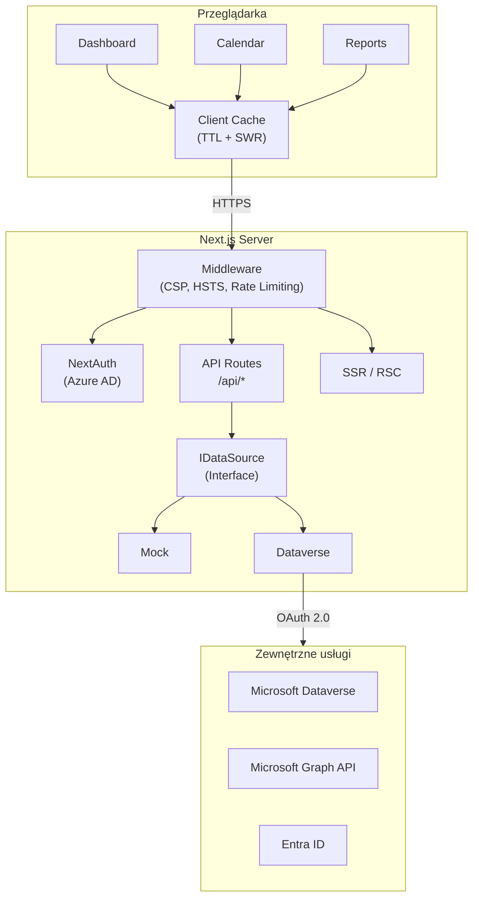

# Developico Timesheet

[](LICENSE)
[](https://nodejs.org/)
[](https://www.typescriptlang.org/)
[](https://nextjs.org/)
[](https://pnpm.io/)

> 🇬🇧 [English version](README.en.md)

Dashboard do rejestracji czasu pracy i zarządzania projektami dla konsultantów. Zbudowany z Next.js 14, TypeScript, Tailwind CSS i shadcn/ui. Integracja z Microsoft Dataverse i Microsoft Graph API.

## � Webinar — demonstracja rozwiązania

[](https://youtu.be/jsWfRVrEmPA?si=977Nu6TE9ZKPTc0S)

## �🎯 Funkcje

### Rejestracja czasu pracy
- Widok kalendarza tygodniowego (8:00–18:00)
- Rejestracja wpisów: projekt, zadanie, godziny, opis, flaga billable
- Oznaczanie dni wolnych / świąt
- Podsumowanie tygodniowe (billable / non-billable)

### Dashboard KPI
- Karty: łączne godziny, aktywne projekty, konsultanci, oczekujące zatwierdzenia
- Wykres godzin tygodniowych (7-dniowy trend)
- Wykres przychodów miesięcznych (6-miesięczny trend)
- Tabela aktywnych projektów z budżetem i przypisaniami

### Zarządzanie projektami
- Lista projektów z filtrami: status, przypisanie, billable, wyszukiwanie
- Sortowanie po dowolnej kolumnie
- Formularz tworzenia projektu (nazwa, kod, klient, status, budżet, daty)
- Panel szczegółów projektu

### Raporty
- Dynamiczny kreator raportów
- Filtrowanie: zakres dat, grupowanie (projekt/konsultant/klient), billable
- Multi-select konsultantów i projektów
- Eksport danych

### Administracja
- Impersonacja konsultantów (ConsultantDock)
- Banner informacyjny (kto przegląda czyje dane)
- RBAC: Consultant | Administrator

## 🏗️ Architektura



## 🚀 Szybki start

### Wymagania

- Node.js 20+ (patrz `.nvmrc`)
- pnpm 10+

### Instalacja

```bash
corepack enable
corepack prepare pnpm@latest --activate
pnpm install
cp .env.example .env.local
pnpm dev
```

Aplikacja: http://localhost:3000 (tryb mock domyślnie).

### Build produkcyjny

```bash
pnpm typecheck
pnpm lint
pnpm test
pnpm build
pnpm start
```

## 📋 Skrypty

| Komenda | Opis |
|---------|------|
| `pnpm dev` | Serwer deweloperski (port 3000) |
| `pnpm dev-turbo` | Serwer z Turbopack |
| `pnpm build` | Build produkcyjny (`standalone`) |
| `pnpm start` | Uruchomienie zbudowanej aplikacji |
| `pnpm typecheck` | Sprawdzenie typów TypeScript |
| `pnpm lint` | ESLint |
| `pnpm test` | Testy jednostkowe (Vitest) |
| `pnpm test:watch` | Testy w trybie watch |
| `pnpm test:e2e` | Testy E2E (Playwright) |
| `pnpm seed:demo` | Załadowanie danych demo |
| `pnpm seed:cleanup` | Usunięcie danych demo |

## 🔧 Konfiguracja

Aplikacja używa walidacji zmiennych środowiskowych (Zod). Pełna lista: [docs/pl/ZMIENNE_SRODOWISKOWE.md](docs/pl/ZMIENNE_SRODOWISKOWE.md).

### Kluczowe zmienne

| Zmienna | Wymagana | Opis |
|---------|----------|------|
| `NEXT_PUBLIC_USE_MOCK` | Nie | `true` (domyślnie) — dane mock |
| `AZURE_AD_CLIENT_ID` | Produkcja | ID aplikacji Entra ID |
| `AZURE_AD_CLIENT_SECRET` | Produkcja | Secret aplikacji |
| `AZURE_AD_TENANT_ID` | Produkcja | ID tenanta Azure |
| `NEXTAUTH_SECRET` | Produkcja | Klucz podpisu JWT |
| `DATAVERSE_ENABLED` | Nie | `true` aby włączyć Dataverse |

## 📂 Struktura projektu

```
app/                   # Next.js App Router
├── api/               # Endpointy REST API
├── calendar/          # Widok kalendarza
├── dashboard/         # Dashboard KPI
├── projects/          # Zarządzanie projektami
└── reports/           # Kreator raportów
components/            # Komponenty React (shadcn/ui)
data/                  # Warstwa danych (IDataSource)
hooks/                 # Custom hooki React
lib/                   # Usługi i narzędzia
types/                 # Typy TypeScript
tests/                 # Testy jednostkowe
e2e/                   # Testy E2E
docs/                  # Dokumentacja
deployment/            # Przewodniki wdrożeniowe
```

## 🔒 Bezpieczeństwo

- Uwierzytelnianie Azure AD (NextAuth.js + MSAL)
- RBAC na grupach bezpieczeństwa (Consultant / Administrator)
- Nagłówki bezpieczeństwa (HSTS, CSP, X-Frame-Options)
- Rate limiting na endpointach API
- Tokeny w pamięci ulotnej (nie na dysku)
- Walidacja danych wejściowych (Zod)
- Redakcja PII w logach

Szczegóły: [SECURITY.md](SECURITY.md)

## 🚢 Wdrożenie

Aplikacja jest wdrażana na **Azure App Service** (Linux, Node 20) za pomocą GitHub Actions.

Szczegóły: [deployment/README.md](deployment/README.md)

## 📖 Dokumentacja

| Dokument | Język | Opis |
|----------|-------|------|
| [Architektura](docs/pl/ARCHITEKTURA.md) | PL | Architektura systemu |
| [API](docs/pl/API.md) | PL | Dokumentacja REST API |
| [Zmienne środowiskowe](docs/pl/ZMIENNE_SRODOWISKOWE.md) | PL | Konfiguracja aplikacji |
| [Lokalne wdrożenie](docs/pl/LOKALNE_WDROZENIE.md) | PL | Setup deweloperski |
| [Role](docs/pl/ROLE.md) | PL | Role i uprawnienia |
| [Schemat Dataverse](docs/pl/DATAVERSE_SCHEMAT.md) | PL | Encje i mapowanie pól |
| [Rozwiązywanie problemów](docs/pl/ROZWIAZYWANIE_PROBLEMOW.md) | PL | Troubleshooting |

Wersje angielskie dostępne w [docs/en/](docs/en/).

## 🤝 Współpraca

Zapraszamy do współpracy! Przeczytaj [CONTRIBUTING.md](CONTRIBUTING.md) przed zgłoszeniem PR.

## 📄 Licencja

MIT — [Developico Sp. z o.o.](https://developico.com) © 2026

Autor: **Łukasz Falaciński** | 📧 contact@developico.com
# Developico-Timesheet

*Project time tracking dashboard (Next.js 14 + TypeScript + Tailwind)*

## Overview

Timesheet / dashboard (Next.js 14 + TypeScript + Tailwind). Mock data layer (`DataService`) gotowa do podłączenia prawdziwego źródła (np. Dataverse).

## Quick Start (pnpm)

```powershell
corepack enable
corepack prepare pnpm@latest --activate
pnpm install
pnpm dev
```

Aplikacja: <http://localhost:3000>

## Production Build

```powershell
pnpm typecheck
pnpm lint
pnpm build
pnpm start
```

## Node / pnpm versions

Zalecane: Node 20 (patrz `.nvmrc`), pnpm >= 8.

## Env Vars

`NEXT_PUBLIC_USE_MOCK=true` (domyślnie) – używa danych mock. Ustawienie na `false` spowoduje błąd (brak implementacji backendu).

## Project Structure

```text
app/                 # Next.js App Router entry
components/          # UI i sekcje (dashboard, calendar, projects)
lib/                 # DataService + filter context
data/                # Dodatkowe mocki / interfejsy
types/               # Typy wspólne
```

## NPM Scripts

```powershell
pnpm dev        # Dev server
pnpm build      # Production build
pnpm start      # Run built app
pnpm lint       # ESLint
pnpm typecheck  # TypeScript checks
```

## Deployment

### Azure App Service (Linux B1) Notes

Compatible with Node 20 LTS or 22 LTS. Current `engines` allow both (`20.x || 22.x`).

Recommended App Settings on Azure (Configuration > Application settings):

```bash
WEBSITES_PORT=3000              # App Service will route to this port
PORT=3000                       # Redundancy – Next.js uses this when provided
NODE_ENV=Production             # Azure capitalization tolerant, keep consistent
NEXT_PUBLIC_USE_MOCK=true       # Until real data source implemented
```

Startup command: (leave empty). Oryx detection will run the `start` script (`pnpm start` → `next start`).

If using a custom container later: expose 3000 and set `WEBSITES_PORT=3000`.

### Consistent Local Port

Dev script enforces `next dev -p 3000`. If port is busy, Next.js will error instead of auto-switching. Free the port or stop the conflicting process.

## Continue in v0

<https://v0.app/chat/projects/HW7B9onwWkj>

## How Sync Works

1. Edytujesz projekt w [v0.app](https://v0.app)
2. Deploy w interfejsie v0
3. Zmiany trafiają tutaj (repo)
4. Vercel buduje i publikuje najnowszą wersję

## Next Steps (suggested)

- Integracja realnego źródła danych
- Testy (Vitest + Testing Library)
- CI (lint + typecheck + build) w GitHub Actions
- Optymalizacja: RSC dla statycznych części

## Client-side Caching (Quick Win Layer)

Dodano lekki cache w pamięci przeglądarki (`lib/client-cache.ts`) aby uniknąć irytującego ponownego ładowania danych przy każdym powrocie do zakładki/okna.

### Zasada działania

1. Każdy hook (projects, consultants, days off, time entries) woła `getOrLoad(key, loader, { ttlMs, staleWindowMs })`.
2. Jeśli dane są świeże (w `ttlMs`) – zwraca natychmiast (brak spinnera).
3. Jeśli dane są „stale” (po `ttlMs`, ale przed końcem `staleWindowMs`) – zwraca stare dane i *w tle* robi odświeżenie (SWR) aktualizując stan gdy gotowe.
4. Jeśli brak lub przeterminowane poza okno – robi normalny fetch.

### Klucze i TTL

| Dataset | Key format | Fresh TTL | Stale window |
|---------|------------|-----------|--------------|
| Projects | `projects:v1` | 15 min | 2 h |
| Consultants | `consultants:v1` | 15 min | 2 h |
| DaysOff | `daysoff:v1:FROM:TO` | 12 h | 7 dni |
| TimeEntries | `timeEntries:v1:FROM:TO:PROJECT_IDS:BILLABLE` | 30 s | 5 min |

### Prefetch

`ClientRoot` po montażu równolegle pobiera `projects` i `consultants` i zasila cache (`prime`). Dzięki temu pierwszy widok korzysta z już dostępnych danych.

### Invalidacja

Funkcja `invalidate(prefix)` usuwa wpisy których klucz zaczyna się od `prefix`. Na razie niewykorzystana (brak mutacji), ale gotowa pod przyszłe operacje add/update.

### Rozszerzenia (opcjonalnie w przyszłości)

- Persistencja (IndexedDB / localStorage) – cold start bez fetch.
- BroadcastChannel dla synchronizacji wielu kart.
- Migracja do TanStack Query jeśli pojawią się złożone mutacje / optimistic UI.

Kod: `lib/client-cache.ts` – ~200 linii, brak zewnętrznych zależności.

### (Nowe) Flaga `refreshing`

Hooki (`useProjects`, `useConsultants`, `useDaysOff`, `useTimeEntries`) zwracają dodatkowo `refreshing: boolean`:

- `true` gdy dane pochodziły ze stanu `stale` i trwa background fetch.
- Można użyć do subtelnego badge (np. "Aktualizuję…").

Przykład użycia z komponentem `RefreshingBadge`:

```tsx
import { RefreshingBadge } from '@/components/ui/refreshing-badge';
import { useProjects } from '@/hooks/use-projects';

export function ProjectsHeader(){
  const { refreshing } = useProjects();
  return (
    <div className="flex items-center gap-2">
      <h2 className="text-lg font-semibold">Projects</h2>
      <RefreshingBadge refreshing={refreshing} />
    </div>
  );
}
```

### (Nowe) Persistencja localStorage

Wybrane prefiksy (`projects:v1`, `consultants:v1`, `daysoff:v1`) są zapisywane w `localStorage`:

- Przy starcie odczyt + filtracja przeterminowanych wpisów.
- Zmniejsza koszt pierwszego ładowania po F5.
- Dane dynamiczne (`timeEntries`) nie są utrwalane (zbyt częste zmiany / ryzyko staleness).

### (Nowe) Invalidation helpers

`lib/cache-invalidation.ts` udostępnia proste funkcje:

```ts
invalidateProjects();
invalidateConsultants();
invalidateTimeEntries();
invalidateDaysOffRange(from, to);
```

Na razie niepodłączone do mutacji (brak mutacji). Można je wywołać po implementacji POST/PUT/DELETE.


## User Avatars via Microsoft Graph

Endpoint `/api/avatar/[id]` pobiera zdjęcie użytkownika z Microsoft Graph (client credentials).

Wymagane uprawnienia aplikacji (App Registration > API permissions):
`User.ReadBasic.All` (czasem konieczne `User.Read.All`) + admin consent.

Użycie w komponencie:

```tsx
// Użyj aadObjectId (nie systemuserid) dla Graph

```

Fallback: gdy 404 – pokaż inicjały lub placeholder.

## Dynamic CSS Strategy

W projekcie usunięto inline style na rzecz:

1. Atrybutów `data-*` jako selektorów semantycznych.
2. Wstrzykiwania CSS przez jeden skonsolidowany tag `<style id="app-dynamic-styles">` (hook `useAggregatedDynamicCss`).
3. Własnych właściwości CSS (`--seg-0`, `--seg-1`, itp.) zamiast przestarzałego użycia `attr()`. Pozwala to animować długości, szerokości i offsety (np. rysowanie linii max na wykresie) bez inline style.
4. Generowania opóźnień animacji i kolorów w jednym miejscu (deterministyczne i łatwe do diffu).

Zalety:

- Mniej szumów w JSX (brak obiektów `style={{...}}`).
- Łatwiejsza inspekcja: przeglądarka pokazuje jeden blok z pogrupowanymi sekcjami (`/* key */`).
- Możliwość garbage collection — usunięcie komponentu usuwa fragment CSS (cleanup w hooku).

Dodawanie nowego fragmentu dynamicznego:

```ts
useAggregatedDynamicCss('unique-key', `#selector[data-state="x"]{opacity:0}`)
```

Klucz powinien być stabilny; przy unmount zostanie automatycznie usunięty.

W przypadku konieczności debugowania można tymczasowo zalogować `document.getElementById('app-dynamic-styles')?.textContent`.

