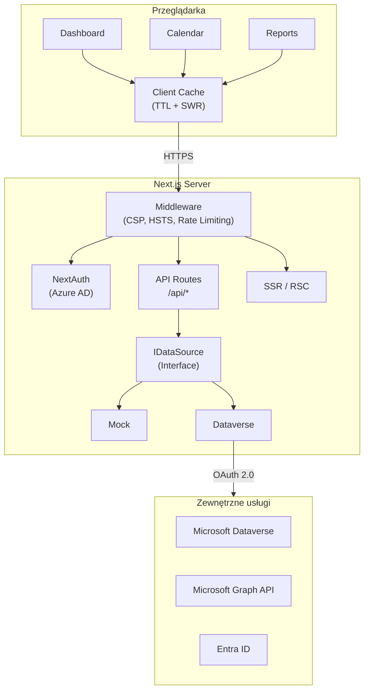

# Developico Timesheet

[](LICENSE)
[](https://nodejs.org/)
[](https://www.typescriptlang.org/)
[](https://nextjs.org/)
[](https://pnpm.io/)

> 🇬🇧 [English version](README.en.md)

Dashboard do rejestracji czasu pracy i zarządzania projektami dla konsultantów. Zbudowany z Next.js 14, TypeScript, Tailwind CSS i shadcn/ui. Integracja z Microsoft Dataverse i Microsoft Graph API.

## � Webinar — demonstracja rozwiązania

[](https://youtu.be/jsWfRVrEmPA?si=977Nu6TE9ZKPTc0S)

## �🎯 Funkcje

### Rejestracja czasu pracy
- Widok kalendarza tygodniowego (8:00–18:00)
- Rejestracja wpisów: projekt, zadanie, godziny, opis, flaga billable
- Oznaczanie dni wolnych / świąt
- Podsumowanie tygodniowe (billable / non-billable)

### Dashboard KPI
- Karty: łączne godziny, aktywne projekty, konsultanci, oczekujące zatwierdzenia
- Wykres godzin tygodniowych (7-dniowy trend)
- Wykres przychodów miesięcznych (6-miesięczny trend)
- Tabela aktywnych projektów z budżetem i przypisaniami

### Zarządzanie projektami
- Lista projektów z filtrami: status, przypisanie, billable, wyszukiwanie
- Sortowanie po dowolnej kolumnie
- Formularz tworzenia projektu (nazwa, kod, klient, status, budżet, daty)
- Panel szczegółów projektu

### Raporty
- Dynamiczny kreator raportów
- Filtrowanie: zakres dat, grupowanie (projekt/konsultant/klient), billable
- Multi-select konsultantów i projektów
- Eksport danych

### Administracja
- Impersonacja konsultantów (ConsultantDock)
- Banner informacyjny (kto przegląda czyje dane)
- RBAC: Consultant | Administrator

## 🏗️ Architektura



## 🚀 Szybki start

### Wymagania

- Node.js 20+ (patrz `.nvmrc`)
- pnpm 10+

### Instalacja

```bash
corepack enable
corepack prepare pnpm@latest --activate
pnpm install
cp .env.example .env.local
pnpm dev
```

Aplikacja: http://localhost:3000 (tryb mock domyślnie).

### Build produkcyjny

```bash
pnpm typecheck
pnpm lint
pnpm test
pnpm build
pnpm start
```

## 📋 Skrypty

| Komenda | Opis |
|---------|------|
| `pnpm dev` | Serwer deweloperski (port 3000) |
| `pnpm dev-turbo` | Serwer z Turbopack |
| `pnpm build` | Build produkcyjny (`standalone`) |
| `pnpm start` | Uruchomienie zbudowanej aplikacji |
| `pnpm typecheck` | Sprawdzenie typów TypeScript |
| `pnpm lint` | ESLint |
| `pnpm test` | Testy jednostkowe (Vitest) |
| `pnpm test:watch` | Testy w trybie watch |
| `pnpm test:e2e` | Testy E2E (Playwright) |
| `pnpm seed:demo` | Załadowanie danych demo |
| `pnpm seed:cleanup` | Usunięcie danych demo |

## 🔧 Konfiguracja

Aplikacja używa walidacji zmiennych środowiskowych (Zod). Pełna lista: [docs/pl/ZMIENNE_SRODOWISKOWE.md](docs/pl/ZMIENNE_SRODOWISKOWE.md).

### Kluczowe zmienne

| Zmienna | Wymagana | Opis |
|---------|----------|------|
| `NEXT_PUBLIC_USE_MOCK` | Nie | `true` (domyślnie) — dane mock |
| `AZURE_AD_CLIENT_ID` | Produkcja | ID aplikacji Entra ID |
| `AZURE_AD_CLIENT_SECRET` | Produkcja | Secret aplikacji |
| `AZURE_AD_TENANT_ID` | Produkcja | ID tenanta Azure |
| `NEXTAUTH_SECRET` | Produkcja | Klucz podpisu JWT |
| `DATAVERSE_ENABLED` | Nie | `true` aby włączyć Dataverse |

## 📂 Struktura projektu

```
app/                   # Next.js App Router
├── api/               # Endpointy REST API
├── calendar/          # Widok kalendarza
├── dashboard/         # Dashboard KPI
├── projects/          # Zarządzanie projektami
└── reports/           # Kreator raportów
components/            # Komponenty React (shadcn/ui)
data/                  # Warstwa danych (IDataSource)
hooks/                 # Custom hooki React
lib/                   # Usługi i narzędzia
types/                 # Typy TypeScript
tests/                 # Testy jednostkowe
e2e/                   # Testy E2E
docs/                  # Dokumentacja
deployment/            # Przewodniki wdrożeniowe
```

## 🔒 Bezpieczeństwo

- Uwierzytelnianie Azure AD (NextAuth.js + MSAL)
- RBAC na grupach bezpieczeństwa (Consultant / Administrator)
- Nagłówki bezpieczeństwa (HSTS, CSP, X-Frame-Options)
- Rate limiting na endpointach API
- Tokeny w pamięci ulotnej (nie na dysku)
- Walidacja danych wejściowych (Zod)
- Redakcja PII w logach

Szczegóły: [SECURITY.md](SECURITY.md)

## 🚢 Wdrożenie

Aplikacja jest wdrażana na **Azure App Service** (Linux, Node 20) za pomocą GitHub Actions.

Szczegóły: [deployment/README.md](deployment/README.md)

## 📖 Dokumentacja

| Dokument | Język | Opis |
|----------|-------|------|
| [Architektura](docs/pl/ARCHITEKTURA.md) | PL | Architektura systemu |
| [API](docs/pl/API.md) | PL | Dokumentacja REST API |
| [Zmienne środowiskowe](docs/pl/ZMIENNE_SRODOWISKOWE.md) | PL | Konfiguracja aplikacji |
| [Lokalne wdrożenie](docs/pl/LOKALNE_WDROZENIE.md) | PL | Setup deweloperski |
| [Role](docs/pl/ROLE.md) | PL | Role i uprawnienia |
| [Schemat Dataverse](docs/pl/DATAVERSE_SCHEMAT.md) | PL | Encje i mapowanie pól |
| [Rozwiązywanie problemów](docs/pl/ROZWIAZYWANIE_PROBLEMOW.md) | PL | Troubleshooting |

Wersje angielskie dostępne w [docs/en/](docs/en/).

## 🤝 Współpraca

Zapraszamy do współpracy! Przeczytaj [CONTRIBUTING.md](CONTRIBUTING.md) przed zgłoszeniem PR.

## 📄 Licencja

MIT — [Developico Sp. z o.o.](https://developico.com) © 2026

Autor: **Łukasz Falaciński** | 📧 contact@developico.com
