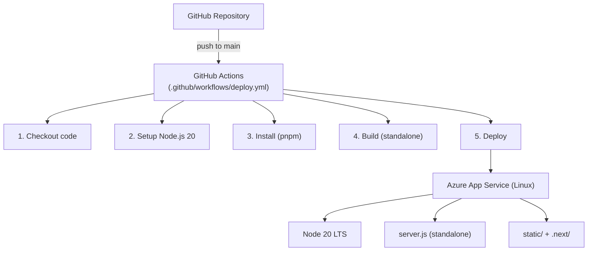

# Wdrożenie na Azure App Service

## Przegląd

Aplikacja jest wdrażana jako standalone Next.js app na Azure App Service (Linux) za pomocą GitHub Actions.

## Architektura wdrożenia



## Konfiguracja App Service

### Tworzenie

1. Azure Portal → App Services → Create
2. Parametry:
   - **Runtime stack**: Node 20 LTS
   - **OS**: Linux
   - **Plan**: Minimum B1 (Basic)
   - **Region**: West Europe (lub najbliższy)

### Ustawienia

| Parametr | Wartość |
|----------|---------|
| Startup Command | `node server.js` |
| Always On | Enabled |
| HTTPS Only | Enabled |
| Minimum TLS | 1.2 |
| Platform | 64-bit |

### Zmienne środowiskowe

W Azure Portal → App Service → Configuration → Application settings:

Dodaj wszystkie zmienne z [ZMIENNE_SRODOWISKOWE.md](../../docs/pl/ZMIENNE_SRODOWISKOWE.md).

> **Ważne**: `NEXTAUTH_URL` musi zawierać pełny URL produkcyjny (np. `https://timesheet.developico.com`).

## GitHub Actions Workflow

Plik: `.github/workflows/deploy.yml`

### Sekrety wymagane

W GitHub → Settings → Secrets and variables → Actions:

| Secret | Opis |
|--------|------|
| `AZURE_WEBAPP_PUBLISH_PROFILE` | Publish profile pobrany z App Service |

### Pobranie Publish Profile

1. Azure Portal → App Service → Overview
2. Kliknij **Get publish profile** (Download)
3. Skopiuj zawartość XML i wklej jako secret w GitHub

### Przepływ workflow

```yaml
name: Build and deploy
on:
  push:
    branches: [main]

jobs:
  build-and-deploy:
    runs-on: ubuntu-latest
    steps:
      - uses: actions/checkout@v4
      - uses: actions/setup-node@v4
        with:
          node-version: '20'
      - run: corepack enable && pnpm install
      - run: pnpm build
      - uses: azure/webapps-deploy@v3
        with:
          app-name: 'your-app-name'
          publish-profile: ${{ secrets.AZURE_WEBAPP_PUBLISH_PROFILE }}
          package: .
```

## Standalone Output

Next.js jest skonfigurowany z `output: 'standalone'` (`next.config.mjs`):

- Generuje samodzielny serwer Node.js (`server.js`)
- Kopiuje tylko wymagane pliki (`node_modules` trace)
- Katalog `.next/standalone/` zawiera kompletną aplikację
- Pliki statyczne w `.next/static/` muszą być skopiowane do `public/`

## Custom Domain

1. Azure Portal → App Service → Custom domains → Add custom domain
2. Zweryfikuj własność domeny (TXT record)
3. Dodaj CNAME lub A record wskazujący na App Service
4. Dodaj certyfikat SSL (App Service Managed Certificate lub własny)
5. Zaktualizuj `NEXTAUTH_URL` na nową domenę

## Monitorowanie

### Log Stream

Azure Portal → App Service → Log stream — logi w czasie rzeczywistym.

### Application Insights (opcjonalnie)

1. Utwórz Application Insights resource
2. Dodaj `APPLICATIONINSIGHTS_CONNECTION_STRING` do zmiennych
3. Dodaj pakiet `@azure/monitor-opentelemetry` (opcjonalnie)

## Skalowanie

### Vertical (Scale up)

Zmiana planu App Service:

| Plan | CPU | RAM | Cena orientacyjna |
|------|-----|-----|-------------------|
| B1 | 1 | 1.75 GB | ~$13/mies. |
| S1 | 1 | 1.75 GB | ~$70/mies. |
| P1v3 | 2 | 8 GB | ~$130/mies. |

### Horizontal (Scale out)

W planie Standard+ można włączyć autoscaling:
- Metryka: CPU % > 70
- Min instances: 1
- Max instances: 3
