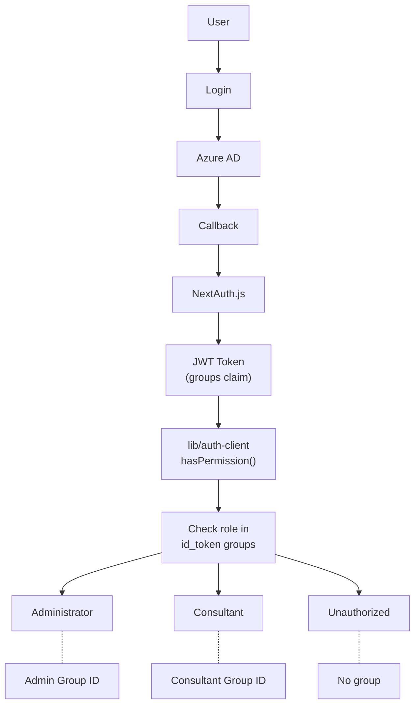

# Roles & Permissions

## Table of Contents

- [Overview](#overview)
- [Role Mapping](#role-mapping)
- [Permissions Matrix](#permissions-matrix)
- [Impersonation](#impersonation)
- [Entra ID Group Configuration](#entra-id-group-configuration)
- [Authentication Flow](#authentication-flow)

## Overview

The role system is based on Microsoft Entra ID security group membership. Roles are assigned automatically based on group claims (`groups` claim) in the ID token.

## Role Mapping

| Role | Source | Condition |
|------|--------|-----------|
| `Administrator` | Entra ID | User is a member of `ADMIN_GROUP_ID` group |
| `Consultant` | Entra ID | User is a member of `CONSULTANT_GROUP_ID` group |
| `Unauthorized` | No group | User does not belong to any defined group |

### Priority

If a user belongs to both groups, the `Administrator` role is assigned (higher priority).

## Permissions Matrix

| Operation | Consultant | Administrator |
|-----------|:----------:|:-------------:|
| **Calendar** | | |
| View own calendar | ✅ | ✅ |
| Register time (own) | ✅ | ✅ |
| Edit / delete entries (own) | ✅ | ✅ |
| **Dashboard** | | |
| View KPI (own data) | ✅ | ✅ |
| View KPI (any consultant) | ❌ | ✅ |
| **Projects** | | |
| View assigned projects | ✅ | ✅ |
| View all projects | ❌ | ✅ |
| **Reports** | | |
| Access reports module | ❌ | ✅ |
| Generate reports | ❌ | ✅ |
| Export PDF | ❌ | ✅ |
| **Administration** | | |
| Impersonate consultant | ❌ | ✅ |
| ConsultantDock (consultant selector) | ❌ | ✅ |

## Impersonation

Administrators can switch view to any consultant via the **ConsultantDock** component (right panel).

### Mechanism

1. Admin selects a consultant from the list (ConsultantDock)
2. `ViewingScopeContext` stores context in `sessionStorage`
3. Dashboard / calendar / KPI components load the selected consultant's data
4. `ViewingBanner` indicates impersonation mode
5. Closing the panel restores the admin's own view

### Security

- Only users with the `Administrator` role see ConsultantDock
- Impersonation does not change the session — admin remains logged in as themselves
- Write operations are delegated to the API with a `consultantId` parameter
- `sessionStorage` resets when the tab is closed

## Entra ID Group Configuration

### 1. Create security groups

In Azure Portal → Entra ID → Groups:

| Group | Type | Description |
|-------|------|-------------|
| `TT-Administrators` | Security | System administrators |
| `TT-Consultants` | Security | Consultants (operational users) |

### 2. Copy Object ID

Each group has a unique **Object ID** (UUID) — copy it to environment variables.

### 3. Add groups claim

In App Registration → Token configuration → Add groups claim:

1. Select: **Security groups**
2. Token: **ID** (check)
3. Optionally: **Access** (if using custom scope)

### 4. Configure variables

```env
ADMIN_GROUP_ID=xxxxxxxx-xxxx-xxxx-xxxx-xxxxxxxxxxxx
CONSULTANT_GROUP_ID=xxxxxxxx-xxxx-xxxx-xxxx-xxxxxxxxxxxx
```

## Authentication Flow



### Implementation (`pages/api/auth/[...nextauth].ts`)

1. **OAuth callback** — extracts `groups[]` from `id_token`
2. **JWT callback** — maps groups to roles, stores `oid`, `accessToken`
3. **Session callback** — exposes role and ID in client session
4. **Access token** — stored in volatile store (in-memory, AES-256-GCM encrypted)
