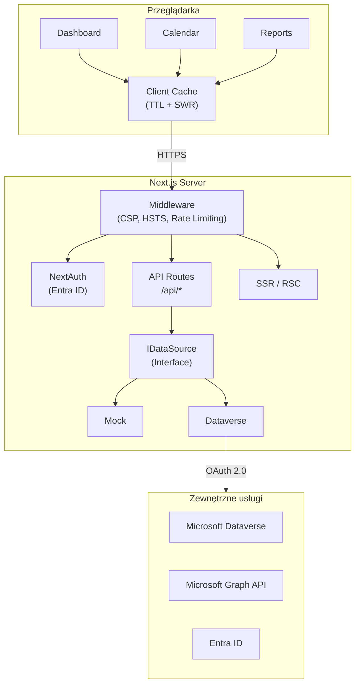

# Architektura systemu

## Spis treści

- [Przegląd](#przegląd)
- [Stos technologiczny](#stos-technologiczny)
- [Diagram architektury](#diagram-architektury)
- [Warstwa prezentacji](#warstwa-prezentacji)
- [Warstwa API](#warstwa-api)
- [Warstwa danych](#warstwa-danych)
- [Uwierzytelnianie i autoryzacja](#uwierzytelnianie-i-autoryzacja)
- [Middleware](#middleware)
- [Cache kliencki](#cache-kliencki)
- [Logowanie](#logowanie)

## Przegląd

Developico Timesheet to aplikacja webowa zbudowana na Next.js 14 (App Router + Pages Router) z TypeScript, służąca do rejestracji czasu pracy i zarządzania projektami. Komunikuje się z Microsoft Dataverse (CRM) jako backend danych oraz Microsoft Graph API do pobierania informacji o użytkownikach.

## Stos technologiczny

| Warstwa | Technologia |
|---------|-------------|
| Framework | Next.js 14.2 (App Router + Pages Router hybrid) |
| Język | TypeScript 5.0 (strict mode) |
| UI | React 18.3 + shadcn/ui + Radix UI |
| Style | Tailwind CSS 4.1 |
| Uwierzytelnianie | NextAuth.js 4.24 + @azure/msal-node 3.7 |
| Walidacja | Zod 3.25 |
| Testy | Vitest 4.0 (unit) + Playwright 1.58 (E2E) |
| Package manager | pnpm 10 |
| Wdrożenie | Azure App Service (Linux, standalone output) |
| CI/CD | GitHub Actions |

## Diagram architektury



## Warstwa prezentacji

### Strony (App Router)

| Ścieżka | Opis |
|----------|------|
| `/` | Strona główna (redirect do dashboard) |
| `/dashboard` | Dashboard KPI z kartami, wykresami, tabelą projektów |
| `/calendar` | Widok kalendarza tygodniowego z rejestracją czasu |
| `/projects` | Lista projektów z filtrami i panelem szczegółów |
| `/reports` | Kreator raportów z filtrami i eksportem |

### Komponenty

Aplikacja używa komponentów **shadcn/ui** (Radix UI + Tailwind) zorganizowanych w:

- `components/ui/` — prymitywy (Button, Dialog, Select, Toast, itp.)
- `components/dashboard/` — karty KPI, wykresy
- `components/calendar/` — widżety kalendarza
- `components/projects/` — tabele, panele szczegółów
- `components/admin/` — ConsultantDock, ViewingBanner
- `components/layout/` — Navbar, FilterBar, NavigationTabs

### Strategia CSS

Zamiast inline `style={{...}}` projekt używa:

1. Atrybutów `data-*` jako selektorów semantycznych
2. Jednego skonsolidowanego tagu `<style id="app-dynamic-styles">` (hook `useAggregatedDynamicCss`)
3. Własnych właściwości CSS (`--seg-0`, `--seg-1`) do animacji i pozycjonowania

## Warstwa API

Endpointy REST w `app/api/`:

| Ścieżka | Metoda | Opis | Auth |
|----------|--------|------|------|
| `/api/health` | GET | Health check (status, data source) | Nie |
| `/api/me` | GET | Profil zalogowanego użytkownika | Tak |
| `/api/me/photo` | GET | Zdjęcie użytkownika (Graph) | Tak |
| `/api/dataverse/consultants` | GET | Lista konsultantów | Tak |
| `/api/dataverse/projects` | GET | Lista projektów | Tak |
| `/api/dataverse/timeentries` | GET | Wpisy czasu (filtrowane) | Tak |
| `/api/dataverse/project-assignments` | GET | Przypisania konsultanta | Tak |
| `/api/dataverse/project-team` | GET | Zespół projektu | Tak |
| `/api/dataverse/days-off` | GET | Dni wolne w zakresie | Tak |
| `/api/graph/consultants` | GET | Konsultanci z grupy AD | Tak |
| `/api/graph/users/[id]/photo` | GET | Zdjęcie użytkownika po ID | Tak |
| `/api/reports/data` | GET | Dane raportowe (agregacja) | Admin |
| `/api/reports/pdf` | POST | Eksport raportu do PDF | Admin |

### Guardy API

- `requireAuth(req)` — weryfikuje JWT z NextAuth, zwraca token i OID
- `isAuthError(auth)` — sprawdza czy auth zwrócił błąd (401/403)
- Walidacja parametrów: Zod schemas (400 przy błędnych danych)
- Korelacja: każdy request dostaje `cid` (correlation ID)

## Warstwa danych

### Interface `IDataSource`

```typescript
interface IDataSource {
  getConsultants(): Promise<Consultant[]>
  getProjects(currentConsultantId?: string): Promise<Project[]>
  getTimeEntries(params: TimeEntryFilters): Promise<TimeEntry[]>
  getProjectAssignments?(consultantId: string): Promise<string[]>
  getProjectTeam?(projectId: string): Promise<string[]>
  getDaysOff?(from: string, to: string): Promise<{ date: string; name?: string }[]>
}
```

### Implementacje

| Źródło | Plik | Opis |
|--------|------|------|
| **Mock** | `data/mock.ts` | Dane testowe, domyślnie aktywne (`NEXT_PUBLIC_USE_MOCK=true`) |
| **Dataverse** | `data/dataverse.ts` | Microsoft Dataverse (CRM) via OData v4.0 |

### Factory

`data/source.ts` — wybiera implementację na podstawie `NEXT_PUBLIC_USE_MOCK`.

### Klient Dataverse

`lib/dataverse-client.ts` — klasa `DataverseClient`:

- Retry logic: 429/503 z exponential backoff (do 3 prób)
- Paginacja: automatyczne śledzenie `@odata.nextLink`
- Token: OAuth 2.0 client credentials (MSAL)
- Konfiguracja pól: `lib/dataverse-config.ts` (wszystkie logiczne nazwy z env vars)

## Uwierzytelnianie i autoryzacja

### Flow

1. Użytkownik loguje się przez Azure AD (OAuth 2.0 Authorization Code)
2. NextAuth.js przetwarza callback, wyciąga grupy z `id_token`
3. Role mapowane: grupa Admin → `Administrator`, grupa Consultant → `Consultant`
4. Access token → volatile store (in-memory, szyfrowany)
5. Sesja JWT → httpOnly cookie

### Role

| Rola | Uprawnienia |
|------|-------------|
| `Administrator` | Pełny dostęp (CRUD + raporty + impersonacja) |
| `Consultant` | Odczyt/zapis własnych danych |
| `Unauthorized` | Brak dostępu (brak pasującej grupy) |

### Impersonacja

Administratorzy mogą przełączać widok na dowolnego konsultanta (ConsultantDock). Kontekst przechowywany w `ViewingScopeContext` (sessionStorage).

## Middleware

`middleware.ts` stosuje do wszystkich odpowiedzi:

| Nagłówek | Wartość |
|----------|---------|
| `Strict-Transport-Security` | `max-age=63072000; includeSubDomains; preload` |
| `Content-Security-Policy` | Strict defaults + wyjątki dla Next.js/Tailwind |
| `X-Frame-Options` | `DENY` |
| `X-Content-Type-Options` | `nosniff` |
| `Referrer-Policy` | `strict-origin-when-cross-origin` |
| `Permissions-Policy` | `camera=(), microphone=(), geolocation=()` |

### Rate Limiting

Rate limiter (sliding window, in-memory) na trasach `/api/*`:

- Trasy auth: wyższy limit
- Pozostałe: standardowy limit
- Odpowiedź 429 z nagłówkiem `Retry-After`
- Automatyczne czyszczenie wygasłych wpisów

## Cache kliencki

`lib/client-cache.ts` implementuje wzorzec TTL + Stale-While-Revalidate:

| Dane | Fresh TTL | Stale window |
|------|-----------|--------------|
| Projects | 15 min | 2 h |
| Consultants | 15 min | 2 h |
| Days Off | 12 h | 7 dni |
| Time Entries | 30 s | 5 min |

### Mechanizm

1. Dane świeże (w TTL) → zwrot natychmiastowy
2. Dane stale (po TTL, przed końcem okna) → zwrot + odświeżenie w tle
3. Brak lub przeterminowane → normalny fetch

### Prefetch

`ClientRoot` przy montażu równolegle pobiera `projects` i `consultants`.

### localStorage

Wybrane prefiksy (`projects:v1`, `consultants:v1`, `daysoff:v1`) trwale zapisywane w `localStorage`.

## Logowanie

`lib/app-logger.ts` — strukturalne logowanie:

- Poziomy: `debug`, `info`, `warn`, `error`
- Automatyczna redakcja PII (tokeny, e-mail, secret)
- Korelacja requestów (`cid`)
- Tryby: `console` (domyślnie), `file`, `silent` (env `LOG_MODE`)
